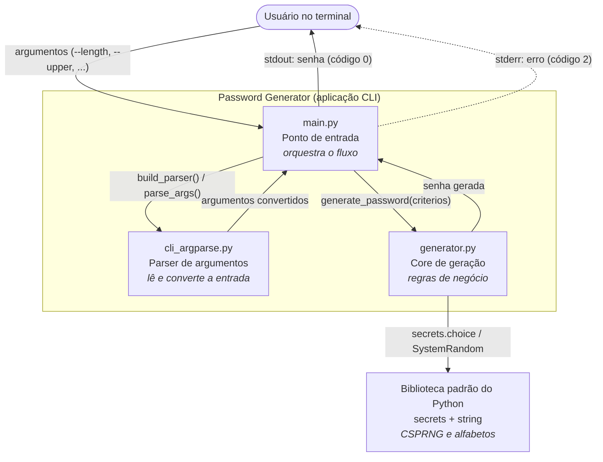
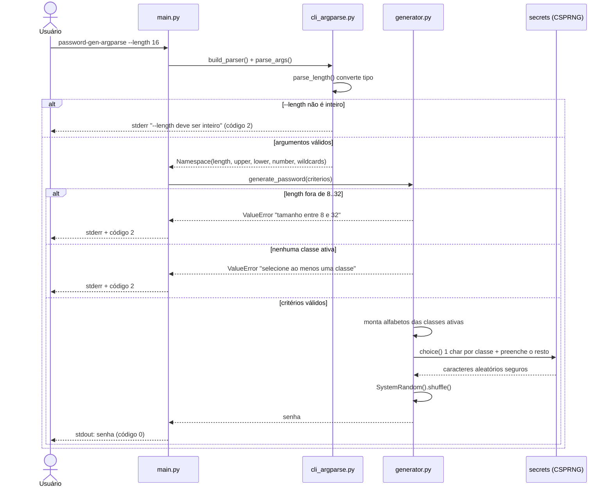

# Password Generator

Gerador de senhas seguras em **Python 3.10.5** com interface CLI em `argparse`.

## Objetivo

Fornecer uma CLI simples para gerar senhas fortes com validações de entrada,
permitindo configurar tamanho e classes de caracteres.

## Stack

- Python 3.10.5
- argparse
- secrets + string
- pytest
- setuptools + pyproject.toml

## Estrutura

- `src/main.py`: ponto de entrada.
- `src/cli_argparse.py`: parser e validações da CLI.
- `src/generator.py`: lógica de geração de senha.
- `tests/test_generator.py`: testes automatizados.
- `docs/escopo-mvp.md`: escopo funcional.

## Documentação

### Engenharia de requisitos (`requisitos/`)

- `requisitos/analise-elicitacao.md`: análise crítica da elicitação — requisitos, regras de negócio,
  RNFs, lacunas e ambiguidades.
- `requisitos/historias-usuario.md`: histórias de usuário com critérios de aceite em Gherkin.
- `requisitos/casos-de-uso.md`: casos de uso expandidos, com fluxos alternativos e de exceção.
- `requisitos/prototipo-cli.md`: protótipo de interface (transcrições reais de terminal).
- `requisitos/rastreabilidade.md`: justificativa dos artefatos e matriz de rastreabilidade.

### Gestão do projeto

- `riscos/`: identificação, análise e respostas aos riscos.
- `comunicacao/stakeholders.md`: comunicado de atualização do projeto.
- `docs/release.md`: checklist de release v1.0.0.

### Discovery — Diagrams as Code (Unidade III)

- `docs/discovery-diagrams-as-code.md`: descrição do sistema em linguagem natural,
  diagramas em Mermaid (containers C4 e sequência) e as decisões/ajustes sobre o que a
  GenAI gerou. Os diagramas renderizados também aparecem na seção abaixo.

## Arquitetura (Diagrams as Code)

Diagramas versionáveis em Mermaid, pensados para servir de contexto a agentes de
desenvolvimento. Detalhes, decisões e ajustes em
[`docs/discovery-diagrams-as-code.md`](docs/discovery-diagrams-as-code.md).

### Visão de containers (C4 nível 2)



### Jornada crítica — gerar uma senha



## Pré-requisitos

- Python 3.10.5 no `PATH`
- `pip` habilitado

Validação rápida:

```powershell
python --version
python -m pip --version
```

## Instalação e Execução

### Windows (recomendado neste projeto)

```powershell
.\make install
.\make run
.\make test
.\make uninstall
```

### Linux/macOS

```bash
make install
make run
make test
make uninstall
```

### Instalação manual (sem make)

```powershell
python -m venv .venv
.\.venv\Scripts\python.exe -m pip install --upgrade pip
.\.venv\Scripts\python.exe -m pip install -e .[dev]
```

## Comandos Disponíveis

### CLI instalada

```powershell
password-gen-argparse --length 16
```

### Execução direta por módulo

```powershell
python src/main.py --length 16
```

### Parâmetros da CLI

- `--length`: tamanho da senha (8 a 32, padrão 16)
- `--lower` / `--no-lower`: minúsculas (padrão **habilitado**)
- `--upper` / `--no-upper`: maiúsculas (padrão **habilitado**)
- `--number` / `--no-number`: números (padrão **habilitado**)
- `--wildcards` / `--no-wildcards`: especiais (padrão **habilitado**)

Caracteres especiais utilizados:

```text
!"#$%&'()*+,-./:;<=>?@[\]^_`{|}~
```

A senha sempre contém **ao menos um caractere de cada classe ativa**.

Sem argumentos, a senha usa as quatro classes:

```powershell
password-gen-argparse
```

```text
EuJf(~dkcv#oIRq8
```

Se o sistema de destino não aceitar símbolos, desligue a classe:

```powershell
password-gen-argparse --length 20 --no-wildcards
```

```text
iVRXA3TiToHJxTk81MrE
```

## Targets do Makefile

- `install`: cria/atualiza `.venv` e instala `.[dev]`
- `run`: executa `src/main.py --length 16`
- `test`: executa `pytest -q`
- `uninstall`: remove o pacote `password-generator` do `.venv`

## Erros Esperados

- `--length` fora da faixa (ex.: 7 ou 33):
  - `O tamanho da senha deve estar entre 8 e 32.`
- nenhuma classe ativa (`--no-lower --no-upper --no-number --no-wildcards`):
  - `Selecione ao menos uma classe de caractere.`
- tipo inválido em `--length` (ex.: `abc`):
  - `O valor de --length deve ser um numero inteiro.`

## Contrato de Saída

Útil para uso em scripts:

| Situação | `stdout` | `stderr` | Código de saída |
|----------|----------|----------|-----------------|
| Senha gerada | a senha, uma linha, sem rótulo | vazio | `0` |
| `--help` | texto de ajuda | vazio | `0` |
| Erro de validação | **vazio** | mensagem de erro | `2` |

Como as mensagens de erro nunca vão para `stdout`, capturar a senha é seguro:

```bash
PASSWORD=$(password-gen-argparse --length 24)
```

## Validação Rápida do Projeto

```powershell
.\make install
.\make test
.\make run
```

Resultado esperado dos testes:

```text
24 passed
```
