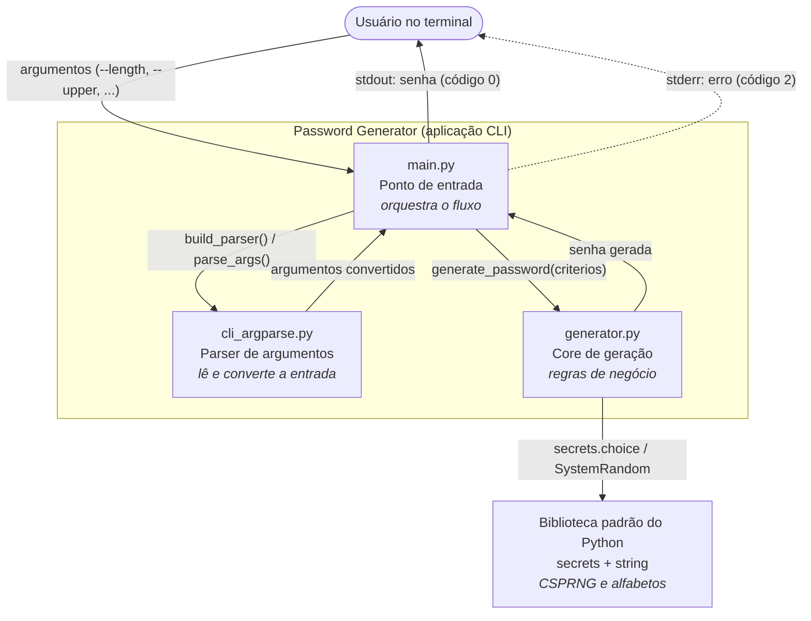
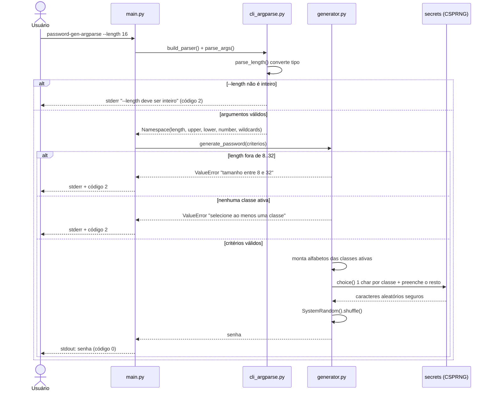

# Discovery de Documentação — Diagrams as Code

> Atividade da Unidade III: praticar a abordagem *diagrams as code*, documentando um
> sistema real em linguagem natural e derivando dele diagramas versionáveis (Mermaid),
> pensados para servir de contexto a agentes de desenvolvimento no futuro.

## Sistema escolhido

**Password Generator** — uma aplicação de linha de comando (CLI), escrita em Python
3.10.5, que gera senhas seguras de forma local. É o próprio sistema deste repositório,
já implementado e documentado (escopo, requisitos, riscos), o que permite confrontar o
que a IA infere com o que o produto realmente faz.

## 1. Descrição em linguagem natural

### 1.1 Escopo

Gerar senhas fortes a partir de parâmetros informados no terminal: tamanho (8–32,
padrão 16) e quais classes de caractere usar (minúsculas, maiúsculas, números e
especiais — todas ativas por padrão). A senha vai para a saída padrão (`stdout`), em
uma única linha, sem rótulos. Não há interface gráfica, persistência, rede ou
integração externa.

### 1.2 Nível da visão

Documentação em dois níveis:

- **Estrutural** — visão de *containers* inspirada no C4 (nível 2), mostrando os blocos
  internos da aplicação e as fronteiras de execução.
- **Comportamental** — diagrama de sequência da jornada crítica "gerar uma senha",
  incluindo os dois caminhos de exceção (faixa inválida e nenhuma classe ativa).

### 1.3 Limites e responsabilidades

| Componente | Responsabilidade |
|------------|------------------|
| `main.py` (ponto de entrada) | Orquestra o fluxo: aciona o parser, chama o core e imprime o resultado ou converte erro em saída de CLI. |
| `cli_argparse.py` (parser) | Lê e converte argumentos (`--length`, `--upper/--no-upper`, etc.). Não valida a faixa de tamanho: apenas o tipo. |
| `generator.py` (core) | Fonte única das regras de negócio: faixa de tamanho (`MIN_LENGTH`/`MAX_LENGTH`), exigência de ao menos uma classe ativa, representatividade de cada classe e uso de CSPRNG (`secrets`). |
| Biblioteca padrão (`secrets`, `string`) | Aleatoriedade criptograficamente segura e alfabetos. |

### 1.4 Integrações

Nenhuma integração externa. A aplicação depende apenas da biblioteca padrão do Python.
Não acessa rede, disco, banco de dados nem serviços de terceiros. A única "interface"
é o terminal do usuário (argumentos de entrada e `stdout`/`stderr` de saída).

### 1.5 Restrições

- **Linguagem/versão:** Python 3.10.5+ (usa `argparse.BooleanOptionalAction`, disponível a partir do 3.9).
- **Segurança:** aleatoriedade obrigatoriamente via `secrets` (CSPRNG), nunca `random`.
- **Contrato de saída:** sucesso → senha em `stdout` + código de saída `0`; erro de
  validação → mensagem em `stderr` + código de saída `2`; `stdout` fica vazio no erro.
- **Sem persistência:** a aplicação nunca grava a senha em arquivo, log ou variável de ambiente.

### 1.6 Lacunas conhecidas (herdadas da análise de requisitos)

Documentadas em `requisitos/analise-elicitacao.md` e mantidas explícitas de propósito:

- **L01** — não há limiar de entropia definido nem referência normativa (ex.: NIST SP 800-63B).
- **L07** — geração em lote (`--count N`) não está no escopo da v1.0.0.
- **L08** — exclusão de caracteres ambíguos (`l`/`1`/`I`, `O`/`0`) não considerada.

## 2. Diagrama estrutural — Visão de containers (C4 nível 2)

## 3. Diagrama comportamental — Jornada "gerar uma senha"

## 4. Decisões e ajustes sobre o que o modelo gerou

O fluxo seguiu o espírito da Unidade III: descrevi o sistema em linguagem natural,
pedi à GenAI os diagramas em Mermaid e só então revisei o resultado contra o código
real (`src/`) antes de versionar.

### 4.1 O que o modelo inferiu corretamente

- A **separação em três camadas** (ponto de entrada, parser e core) e o papel de cada
  uma. O modelo acertou que o parser lida com entrada e o core concentra a geração.
- O uso de **`secrets` como fonte de aleatoriedade** e a garantia de **ao menos um
  caractere por classe ativa** — dois pontos que aparecem no código e o modelo trouxe
  no esqueleto do diagrama de sequência.
- A ideia de representar os **caminhos de exceção** como ramos do fluxo, não como um
  detalhe secundário.

### 4.2 O que precisei ajustar (decisões minhas)

- **Localização da validação de faixa.** O modelo colocou a validação de `--length`
  (8–32) no parser. No código real ela vive **só no core** (`generator.py`), e o parser
  valida apenas o tipo. Movi isso no diagrama para não induzir um agente a duplicar a
  regra — foi exatamente um dos riscos tratados na análise de requisitos (R08:
  validação duplicada entre camadas).
- **Ordem dos erros.** Ajustei o diagrama de sequência para refletir que o erro de tipo
  (`--length` não inteiro) ocorre no parser, antes de chegar ao core, e os demais erros
  (faixa e classes) ocorrem no core.
- **Container inventado.** O modelo sugeriu um "módulo de configuração" e um "logger"
  que não existem. Removi ambos: a aplicação não tem configuração persistida e **não
  registra logs** por decisão de segurança (não retenção do segredo, RN08/RNF12).
- **Integrações que não existem.** O modelo desenhou uma seta para "sistema de
  arquivos". Removi: não há I/O de disco. A única saída é `stdout`/`stderr`.

### 4.3 O que a documentação ainda precisaria para um agente construir sem inventar decisões

Os diagramas dão os limites e o comportamento, mas para um agente implementar com
aderência total, sem arbitrar, ainda faltaria fechar contratos e critérios verificáveis:

- **Limiar de entropia / definição de "senha forte" (L01):** sem uma meta objetiva (ex.:
  bits mínimos ou referência ao NIST SP 800-63B), um agente teria de escolher um número.
- **Conjunto exato de caracteres especiais:** hoje é `string.punctuation`, mas convém
  declarar isso como contrato para o agente não substituir por outro conjunto.
- **Texto exato das mensagens de erro** e o **contrato de saída** (códigos 0/2,
  `stdout`/`stderr`): já documentados no README e no protótipo de CLI, mas precisam ser
  referenciados junto aos diagramas para não ficarem implícitos.
- **Regra de representatividade (RN04):** está no código, mas é uma decisão que reduz
  ligeiramente o espaço de busca; um agente precisa saber que ela é intencional.
- **Backlog fora de escopo (L07, L08):** deixar explícito o que **não** implementar,
  para o agente não adicionar `--count` ou exclusão de ambíguos por conta própria.

Por isso essas lacunas permanecem registradas de forma explícita no repositório
(`requisitos/analise-elicitacao.md`), em vez de escondidas: é a diferença entre uma
suposição plausível da IA e uma decisão validada.
