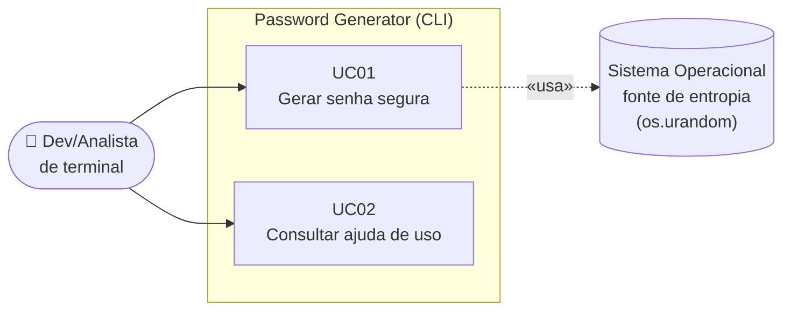

# Casos de Uso — Password Generator

| Campo | Valor |
|-------|-------|
| **Projeto** | Password Generator (MVP — CLI de geração de senhas seguras) |
| **Contexto acadêmico** | UFG — C10 (Engenharia de Requisitos com GenAI) |
| **Documento** | Casos de uso expandidos |
| **Data** | 2026-08-04 |
| **Versão do documento** | 1.0 |
| **Base** | `requisitos/analise-elicitacao.md`, `requisitos/historias-usuario.md` |

## 1. Por que caso de uso *além* de história de usuário

As histórias de usuário descrevem bem o **valor** e o **caminho feliz**, mas nesta aplicação a maior
parte do comportamento está nos **desvios**: três validações distintas, cada uma com mensagem e código de
saída próprios. O caso de uso expandido é o artefato que dá lugar de destaque a **fluxos alternativos e
de exceção**, e por isso complementa — não substitui — as histórias.

Foram especificados **dois** casos de uso. Não se produziu um caso de uso por requisito: isso duplicaria
as histórias sem acrescentar informação (over-specification).

## 2. Diagrama de contexto

**Ator principal:** Dev/Analista de terminal (persona definida em `requisitos/historias-usuario.md`).
**Ator secundário (sistema de apoio):** Sistema Operacional, que fornece a entropia consumida por
`secrets` — dependência que o documento de elicitação não explicitava.

---

## UC01 — Gerar senha segura

| Campo | Valor |
|-------|-------|
| **Identificador** | UC01 |
| **Nome** | Gerar senha segura |
| **Ator principal** | Dev/Analista de terminal |
| **Ator secundário** | Sistema Operacional (fonte de entropia) |
| **Objetivo** | Obter uma senha aleatória que atenda aos critérios de composição informados |
| **Pré-condições** | Python ≥ 3.10.5 disponível; projeto instalado (`make install`) ou acessível via `python src/main.py` |
| **Pós-condição de sucesso** | A senha é exibida em `stdout` e o processo encerra com código 0. Nenhum dado é gravado em disco |
| **Pós-condição de falha** | Mensagem de erro em `stderr`, `stdout` vazio, processo encerra com código 2 |
| **Gatilho** | O usuário executa o comando no terminal |
| **Frequência estimada** | Esporádica e interativa (várias vezes ao dia, sob demanda) |
| **Histórias relacionadas** | US01, US02, US03, US04, US06 |
| **Regras associadas** | RN01–RN10 |

### Fluxo principal (caminho de sucesso)

| # | Ator | Sistema |
|---|------|---------|
| 1 | Executa `password-gen-argparse` com zero ou mais parâmetros | |
| 2 | | Interpreta os argumentos e aplica os padrões ausentes (RN01, RN09) |
| 3 | | Valida o tipo e a faixa de `--length` (RN02) |
| 4 | | Valida que há ao menos uma classe ativa (RN03) |
| 5 | | Valida a compatibilidade entre tamanho e nº de classes (RN05) |
| 6 | | Monta o alfabeto a partir das classes ativas (RN06) |
| 7 | | Sorteia **um caractere de cada classe ativa** para garantir representatividade (RN04) |
| 8 | | Sorteia os caracteres restantes no alfabeto completo, via CSPRNG (RN07) |
| 9 | | Embaralha o resultado com `SystemRandom().shuffle` |
| 10 | | Exibe a senha em `stdout`, em uma linha, e encerra com código 0 (RN10) |
| 11 | Copia a senha e a utiliza | |

> **Observação sobre o passo 7:** essa é a regra **RN04**, que existe no código desde o início mas
> **nunca foi documentada** na elicitação. Sem o passo 7, uma senha com "números ativados" poderia sair
> sem nenhum dígito e ser rejeitada pelo formulário de destino — exatamente o problema que o usuário
> tentava evitar ao ligar a opção.

### Fluxos alternativos

**FA01 — Usuário aceita todos os padrões**
Ocorre no passo 1, quando nenhum argumento é informado.
O sistema aplica tamanho 16 e **apenas minúsculas** (RN01, RN09) e segue do passo 3.
⚠️ **Pendente de decisão** — ver `requisitos/analise-elicitacao.md`, seção 9, item 1.

**FA02 — Usuário desabilita a classe padrão**
Ocorre no passo 1, com `--no-lower` combinado a pelo menos outra classe ativa.
O sistema remove minúsculas do alfabeto e segue normalmente. A senha **não conterá** minúsculas.

### Fluxos de exceção

| ID | Condição | Passo | Resposta do sistema | Código |
|----|----------|-------|---------------------|--------|
| **FE01** | `--length` não conversível para inteiro | 3 | `usage` + `argument --length: O valor de --length deve ser um numero inteiro.` em `stderr` | 2 |
| **FE02** | `--length` fora de 8..32 | 3 | `usage` + `argument --length: O valor de --length deve estar entre 8 e 32.` em `stderr` | 2 |
| **FE03** | Nenhuma classe de caractere ativa | 4 | `usage` + `Selecione ao menos uma classe de caractere.` em `stderr` | 2 |
| **FE04** | Tamanho menor que o nº de classes ativas | 5 | `O tamanho da senha deve ser maior ou igual ao numero de classes ativas.` | 2 |

> **FE04 é inatingível — por qualquer caminho.** Não se trata apenas de a CLI barrar antes: a própria
> função `generate_password()` valida `length ≥ 8` **antes** de contar as classes, e há no máximo 4
> classes. Logo `length < nº de classes` é sempre falsa, mesmo chamando o core diretamente como
> biblioteca. Uma varredura exaustiva confirmou que nenhuma combinação de entrada alcança essa
> validação (ver `requisitos/analise-elicitacao.md`, seção 7.1).
>
> **FE04 permanece documentado aqui como fluxo especificado, mas está sinalizado como não realizável no
> produto atual.** Sua permanência depende da decisão pendente nº 5 da análise. O caso ilustra bem por
> que a especificação foi confrontada com execução real: pelo documento de elicitação, o RF10 parecia um
> requisito implementado e testado.

### Requisitos especiais

- A senha **não** deve ser registrada em log, arquivo ou variável de ambiente pela aplicação (RN08, RNF12).
- A operação deve concluir em **< 200 ms** (RNF07).
- Nenhum acesso à rede é realizado (RNF08).

---

## UC02 — Consultar ajuda de uso

| Campo | Valor |
|-------|-------|
| **Identificador** | UC02 |
| **Nome** | Consultar ajuda de uso |
| **Ator principal** | Dev/Analista de terminal |
| **Objetivo** | Descobrir os parâmetros disponíveis e seus valores padrão |
| **Pré-condições** | Aplicação instalada ou acessível |
| **Pós-condição** | Texto de ajuda exibido em `stdout`; processo encerra com código 0 |
| **Histórias relacionadas** | US05 |
| **Requisitos** | RF16 · **RNF:** RNF03 |

### Fluxo principal

| # | Ator | Sistema |
|---|------|---------|
| 1 | Executa `password-gen-argparse --help` | |
| 2 | | Exibe a linha de uso, a descrição do programa e a lista de parâmetros |
| 3 | | Para cada parâmetro, exibe descrição e valor padrão |
| 4 | | Encerra com código 0 sem gerar senha |

### Fluxo de exceção

Nenhum. `--help` é tratado pelo `argparse` antes de qualquer validação e não pode falhar por
configuração do usuário.

> **Nota de usabilidade:** o texto de ajuda atual **repete o valor padrão** — a descrição escrita à mão
> diz "(padrao: desabilitado)" e o `argparse` acrescenta automaticamente "(default: False)". A duplicação
> é visível na saída real (ver `requisitos/prototipo-cli.md`) e é candidata a ajuste de RNF03.

---

## 3. Rastreamento

A relação entre casos de uso, requisitos, regras, histórias e testes está consolidada em
`requisitos/rastreabilidade.md`.
